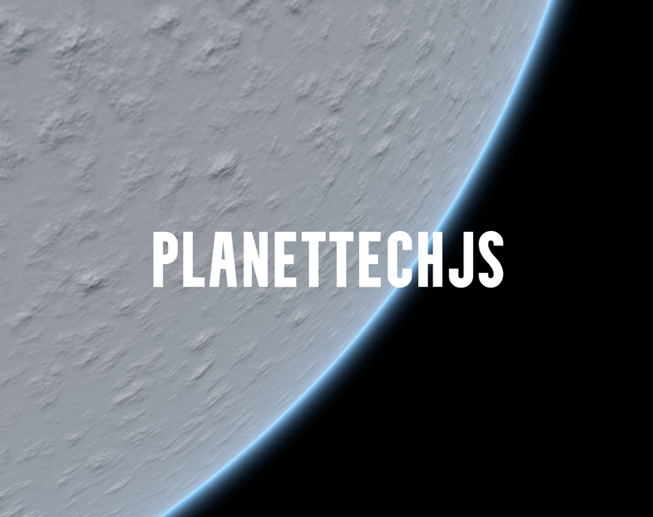

# PlanetTech (ALPHA V0.8)

⚠️ **Disclaimer:** PlanetTech is currently in its **alpha version** and is being actively developed by a single developer. As such, you may encounter bugs, inconsistencies, or missing features. Your feedback, bug reports, and contributions are highly appreciated and will play a crucial role in shaping the future of this library.

  

---

## 🌍 **About PlanetTech**

PlanetTech is an **open-source JavaScript library** built on **THREE.js** that enables the creation of **procedural 3D planets and terrains** using a **quadtree Level of Detail (LOD)** approach. The library is designed to handle **large-scale planet generation** with high resolution, allowing seamless transitions from space to the ground.

Unlike games like *Star Citizen* or *No Man's Sky*, PlanetTech focuses solely on **planet generation**, providing a flexible and powerful toolkit for creating realistic and visually stunning 3D planets. Key features include:

- **Procedural planet generation** with customizable terrain textures.
- **GPU-based rendering** for textures, displacement, and geometry shaping.
- **Atmospheric effects** like volumetric lighting, fog, and scattering.
- **Physics integration** for realistic ground interactions.
- Support for both **WebGL** and **WebGPU** backends.

---

## 🚀 **Getting Started**

### **Prerequisites**
- Node.js (v16 or higher recommended)
- A modern browser with WebGL or WebGPU support (e.g., Chrome, Firefox, Edge)
- Basic knowledge of JavaScript and THREE.js

### **Installation**
To get started with PlanetTech, clone the repository and run the example:

\`\`\`bash
# Clone the repository
$ git clone https://github.com/InterstellarJS/PlanetTech.git

# Navigate to the examples directory
$ cd PlanetTech/examples

# Start a local server
$ python3 -m http.server

# Open your browser and navigate to:
# http://localhost:8000/

https://github.com/miguelmyers8/PlanetTech/assets/18605314/f4621d3a-85ff-4224-be1f-8ae059b7efcc

\`\`\`

### **Using PlanetTech in Your Project**
To integrate PlanetTech into your own project, follow these steps:

1. Install the library locally:
   \`\`\`bash
   $ cd ./to/your/projects/root
   $ git clone https://github.com/InterstellarJS/PlanetTech.git
   $ cd PlanetTech
   $ npm link
   $ cd ..
   $ npm link @interstellar-js-core/planettech && npm install
   \`\`\`

2. Copy the \`coi-serviceworker.js\` file from the \`examples\` directory to your project's root or public folder, and link to it in your \`index.html\`.

3. Start using PlanetTech in your code:
   \`\`\`javascript
   import { Planet } from '@interstellar-js-core/planettech';

   const planet = new Planet();
   planet.initSphere({
     offset: 1 / 1.5,
     levels: 6,
     size: 15,
     radius: 15,
     resolution: 10,
     dimension: 5,
   });
   planet.create();
   scene.add(planet);
   \`\`\`

---

## 🌟 **Features**

### **Core Features**
- **Procedural Planet Generation**: Create unique and realistic planets using procedural algorithms.
- **Quadtree LOD**: Efficiently manage large-scale terrain with dynamic level of detail.
- **GPU-Powered Rendering**: Generate textures, displacement maps, and geometry entirely on the GPU.
- **Atmospheric Effects**: Simulate atmospheric scattering, volumetric lighting, and fog for immersive environments.
- **Physics Integration**: Add realistic ground physics using **Rapier3D**.

### **Upcoming Features**
- **Day-Night Cycle**: Simulate realistic lighting changes over time.
- **Weather Simulation**: Add dynamic weather effects like rain, snow, and storms.
- **Foliage Generation**: Populate planets with procedurally generated vegetation.
- **Texture Editing**: Allow users to edit terrain textures in real-time.

---

## 🛠️ **How It Works**

PlanetTech is built on two main libraries:
1. **PlanetTech**: The backend that handles planet system management, mesh creation, and quadtree data structures.
2. **CubeMap**: The frontend responsible for texture generation.

### **Key Components**
- **WorldSpace**: A post-processing shader that manages the scene's space, including atmospheric effects and lighting.
- **Quadtree Sphere**: A spherical representation of the planet, divided into quadtree nodes for efficient rendering.
- **GPU-Based Rendering**: All textures, displacements, and geometry are generated on the GPU, ensuring high performance.

---

## 📚 **Documentation**

For detailed documentation, including API references and usage examples, check out the [DOC.md](./DOC.md) file.

---

## 🤝 **Contributing**

PlanetTech is an open-source project, and contributions are welcome! Whether you're fixing bugs, adding features, or improving documentation, your help is greatly appreciated.

### **How to Contribute**
1. Fork the repository.
2. Create a new branch for your feature or bugfix.
3. Submit a pull request with a detailed description of your changes.

### **Reporting Issues**
If you encounter any bugs or have suggestions for improvements, please open an issue on the [GitHub Issues page](https://github.com/InterstellarJS/PlanetTech/issues).

---

## 📜 **License**

PlanetTech is licensed under the **Apache License 2.0**. See the [LICENSE.txt](./LICENSE.txt) file for more details.

---

## 🙏 **Acknowledgments**

- **THREE.js**: For providing the foundation for 3D rendering.
- **Rapier3D**: For enabling realistic physics simulations.
- **The Open-Source Community**: For inspiring and supporting this project.

---

## 🌌 **Demo**

Check out the [official demo](https://interstellarjs.github.io/PlanetTech/examples/) to see PlanetTech in action!

---

  <em>Happy planet building! 🚀</em>

